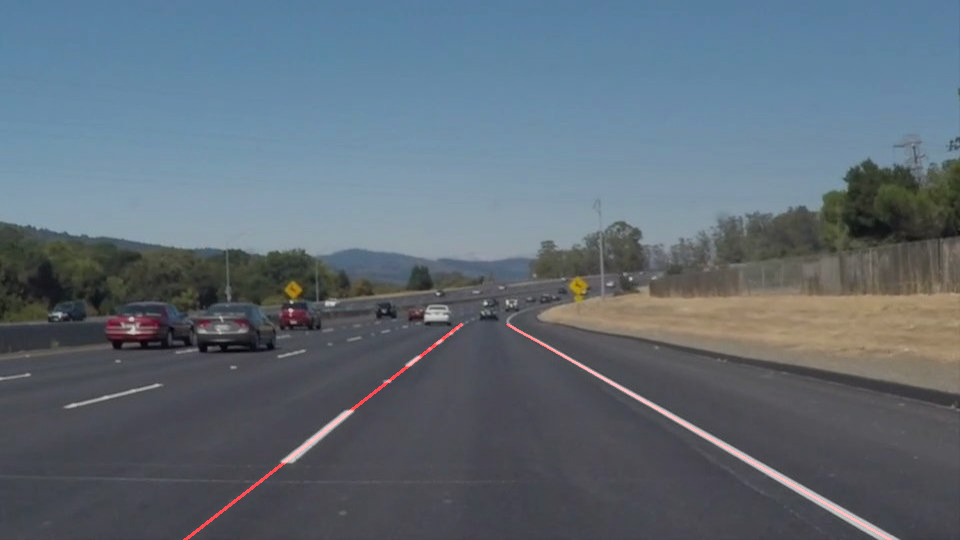

# **Finding Lane Lines on the Road** 

---

**Finding Lane Lines on the Road**

The goals / steps of this project are the following:
* Make a pipeline that finds lane lines on the road
* Reflect on your work in a written report

**Example**

Before:

After:

---

### Reflection

### 1. Describe your pipeline. As part of the description, explain how you modified the draw_lines() function.

My pipeline consisted of 6 steps. First, I converted the images to grayscale, then I applied smoothing.

After that, image went through Canny edge detection and got cut so that only highway was left. 

With that image, since only lane lines were visible, I extracted the coordinates of the lines through Hough Transform.

Using those coordinates, I drew lines over the lanes.

In order to draw a single line on the left and right lanes, I modified the draw_lines() function by creating 4 arrays

that holds x and y coordinates of the right and left lane. Slope of the right lane was bigger than 0.5, while the left lane's slope was

smaller than -0.5. Using that, I sorted them out but added an upper limit for the slope to filter out outliers. After I found the slope

I found the starting and ending points and drew a line through them. 

### 2. Identify potential shortcomings with your current pipeline

One potential shortcoming would be what would happen when lanes curve.

Currently, polifyt is of the first degree and cannot draw curved lines.

### 3. Suggest possible improvements to your pipeline

A possible improvement would be to use higher degree polyfit to draw curved lines.

Another potential improvement would be to use clustering algorithm instead of polyfit. That would include points within certain radius

where radius would be the distance between dashed lines.
